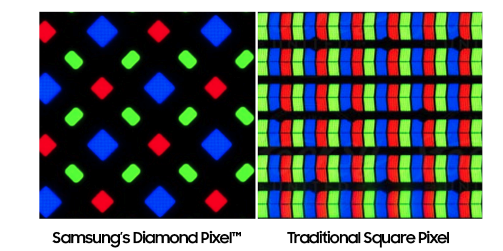

I saw a very impressive metaphor from a lecturer in ASU about the idea of pixel.
- pixel is like a light that can be open or closed.
- every pixel is consisted of three sub lights: red, blue and green lights; and each sublight can be independently controled.
- below is a the pixles of a screen under microscope, and human eyes cannot focus on such small pixels. when each pixel's red, green, blue lights are crank up to brightest, we will see white color.

 

- the value of r, g , b is [0,255] as we all know.  If the values of the three values are same, we call it grey-scale values.
